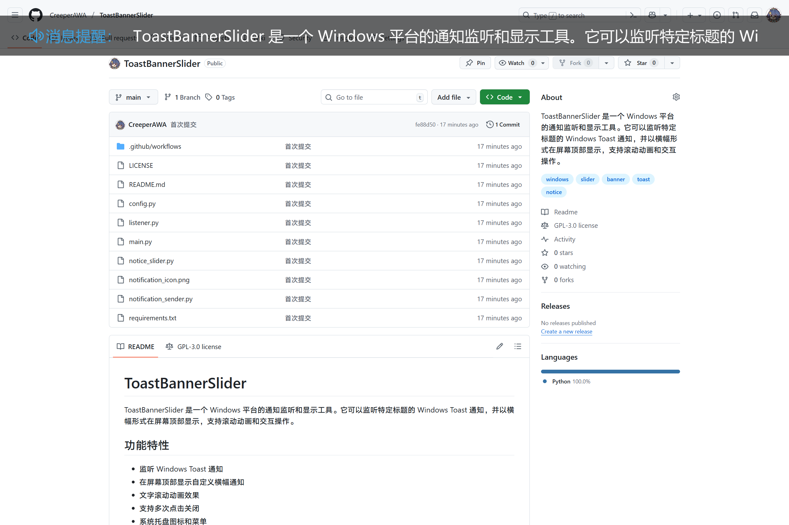

# ToastBannerSlider

ToastBannerSlider 是一个 Windows 平台的通知监听和显示工具。它可以监听特定标题的 Windows Toast 通知，并以横幅形式在屏幕顶部显示，支持滚动动画和交互操作。

## 功能特性

- 监听 Windows Toast 通知
- 在屏幕顶部显示自定义横幅通知
- 文字滚动动画效果
- 支持多次点击关闭
- 系统托盘图标和菜单
- 开机自启功能
- 可配置的通知参数
- 手动发送测试通知

## 界面预览



## 安装依赖

```bash
pip install -r requirements.txt
```

依赖库：
- PySide6: 用于构建图形用户界面
- loguru: 用于日志记录
- winsdk: 用于访问Windows通知数据库
- pywin32: 用于Windows特定功能

## 使用方法

### 运行程序

```bash
python main.py
```

程序启动后会在系统托盘中显示图标，不会弹出主窗口。

### 系统托盘菜单

右键点击系统托盘图标可打开菜单：

- **显示最后通知**: 显示最近一次接收到的通知
- **发送通知**: 手动发送测试通知
- **配置设置**: 配置监听参数
- **开机自启**: 设置程序开机自动启动
- **退出**: 退出程序

双击系统托盘图标也可以显示最后一条通知。

### 配置说明

在配置设置中可以调整以下参数：

1. **通知标题**: 要监听的通知标题（默认为"911 呼唤群"）
2. **滚动速度**: 文字滚动速度，单位为像素/秒（默认为 200px/s）
3. **滚动次数**: 文字滚动循环次数（默认为 3 次）
4. **点击关闭次数**: 点击通知横幅关闭所需的次数（默认为 3 次）

### 通知横幅交互

- 点击通知横幅指定次数（默认 3 次）可关闭通知
- 通知横幅会在显示指定次数（默认 3 次）后自动消失

## 技术架构

### 核心组件

1. **监听模块** ([listener.py](./listener.py)):
   - 监听 Windows Toast 通知数据库
   - 解析通知内容
   - 筛选指定标题的通知

2. **显示模块** ([notice_slider.py](./notice_slider.py)):
   - 创建顶部通知横幅
   - 实现文字滚动动画
   - 处理用户交互

3. **配置模块** ([config.py](./config.py)):
   - 管理程序配置
   - 读写配置文件

4. **主程序** ([main.py](./main.py)):
   - 整合各模块功能
   - 管理系统托盘图标
   - 处理用户交互

### 工作原理

1. 程序启动后会在后台运行通知监听线程
2. 监听线程定期检查 Windows 通知数据库
3. 当发现匹配标题的通知时，通过回调函数传递给主程序
4. 主程序创建通知横幅窗口并显示通知内容
5. 通知横幅具有滚动动画和点击交互功能

## 构建可执行文件

使用以下命令构建可执行文件：

```bash
python -m nuitka --onefile --windows-console-mode="disable" --enable-plugins="pyside6" --main="main.py" --windows-icon-from-ico="notification_icon.ico" --product-name="ToastBannerSlider" --product-version="%VERSION%" --copyright="© 2025 CreeperAWA. All rights reserved." --include-data-file=notification_icon.png=notification_icon.png --include-data-file=notification_icon.ico=notification_icon.ico
```

GitHub Actions CI/CD 自动编译时会自动从环境变量获取版本信息。

## 许可证

<p align="left">
  本项目采用&nbsp;
  <svg xmlns="http://www.w3.org/2000/svg" width="16" height="16" viewBox="0 0 16 16" style="vertical-align: text-bottom; margin-right: 5px;">
    <path d="M8.75.75V2h.985c.304 0 .603.08.867.231l1.29.736c.038.022.08.033.124.033h2.234a.75.75 0 0 1 0 1.5h-.427l2.111 4.692a.75.75 0 0 1-.154.838l-.53-.53.529.531-.001.002-.002.002-.006.006-.006.005-.01.01-.045.04c-.21.176-.441.327-.686.45C14.556 10.78 13.88 11 13 11a4.498 4.498 0 0 1-2.023-.454 3.544 3.544 0 0 1-.686-.45l-.045-.04-.016-.015-.006-.006-.004-.004v-.001a.75.75 0 0 1-.154-.838L12.178 4.5h-.162c-.305 0-.604-.079-.868-.231l-1.29-.736a.245.245 0 0 0-.124-.033H8.75V13h2.5a.75.75 0 0 1 0 1.5h-6.5a.75.75 0 0 1 0-1.5h2.5V3.5h-.984a.245.245 0 0 0-.124.033l-1.289.737c-.265.15-.564.23-.869.23h-.162l2.112 4.692a.75.75 0 0 1-.154.838l-.53-.53.529.531-.001.002-.002.002-.006.006-.016.015-.045.04c-.21.176-.441.327-.686.45C4.556 10.78 3.88 11 3 11a4.498 4.498 0 0 1-2.023-.454 3.544 3.544 0 0 1-.686-.45l-.045-.04-.016-.015-.006-.006-.004-.004v-.001a.75.75 0 0 1-.154-.838L2.178 4.5H1.75a.75.75 0 0 1 0-1.5h2.234a.249.249 0 0 0 .125-.033l1.288-.737c.265-.15.564-.23.869-.23h.984V.75a.75.75 0 0 1 1.5 0Zm2.945 8.477c.285.135.718.273 1.305.273s1.02-.138 1.305-.273L13 6.327Zm-10 0c.285.135.718.273 1.305.273s1.02-.138 1.305-.273L3 6.327Z"/>
  </svg>
  <a href="https://github.com/CreeperAWA/ToastBannerSlider/blob/main/LICENSE">GNU General Public License 3.0</a> 许可证。
</p>